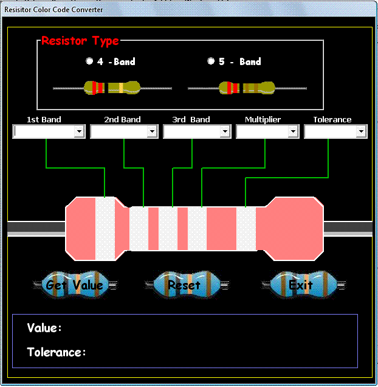



## Resistor Color Code

### Description

This program is able of computing resistor color codes according to resistor types.
 
### More Info
 

             |
---                |---
**Submitted On**   |2010-02-06 19:48:50
**By**             |[Ferdinand Viray](https://github.com/Planet-Source-Code/PSCIndex/blob/master/ByAuthor/ferdinand-viray.md)
**Level**          |Beginner
**User Rating**    |4.3 (13 globes from 3 users)
**Compatibility**  |VB 6\.0
**Category**       |[Miscellaneous](https://github.com/Planet-Source-Code/PSCIndex/blob/master/ByCategory/miscellaneous__1-1.md)
**World**          |[Visual Basic](https://github.com/Planet-Source-Code/PSCIndex/blob/master/ByWorld/visual-basic.md)
**Archive File**   |[Resistor\_C217447272010\.zip](https://github.com/Planet-Source-Code/ferdinand-viray-resistor-color-code__1-72904/archive/master.zip)

